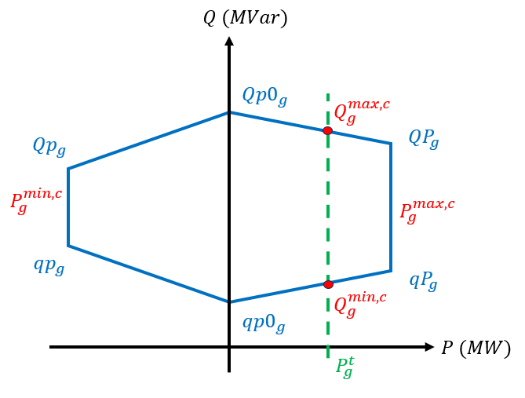
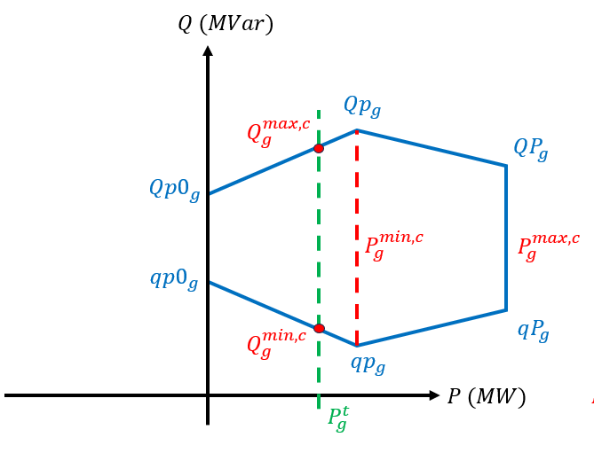
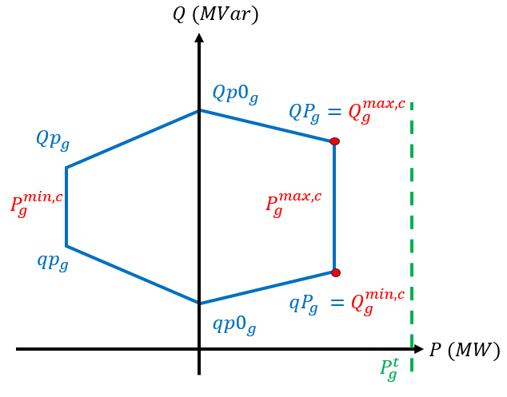
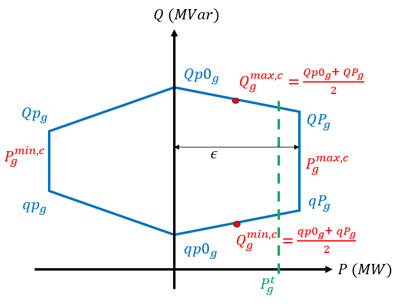

# Pre-processing

Before solving the reactive ACOPF described in [AC optimal powerflow](acOptimalPowerflow.md), the following pre-processing blocks are executed to ensure the consistency of the values used in the optimization. 

## Voltage level limit consistency

To ensure consistent voltage level limits for the buses, the configurable domain [`min_plausible_low_voltage_limit`; `max_plausible_high_voltage_limit`] is used (see [Configuration of the run](inputs.md#configuration-of-the-run)). 

Let $V_{s}^{min}$ (resp. $V_{s}^{max}$) be the low (resp. high) voltage limit of substation $s$ specified in `ampl_network_substations.txt` (or in `ampl_network_substations_override.txt` if an override is given for $s$) and $V_{s}^{min,c}$ (resp. $V_{s}^{max,c}$) its associated corrected low (resp. high) limit. Then, the limits are calculated as follows:
- $V_{s}^{min,c} = \max(V_{s}^{min},$ min_plausible_low_voltage_limit)
- $V_{s}^{max,c} = \min(V_{s}^{max},$ max_plausible_low_voltage_limit)

## Zero-impedance threshold

Branches with an impedance magnitude, **calculated in per unit**, lower than the configurable threshold `Znull` (see section [Configuration of the run](inputs.md#configuration-of-the-run)) are considered as non-impedant. 
These branches will have their reactance replaced by the threshold `Znull` (in p.u.), **even if the reactance specified in `ampl_network_branches.txt` is negative**.
Note that for lines considered as non-impedant and connecting two different nominal voltage levels, the conductances and susceptances are cancelled in order to avoid numerical instabilities.

## Impedance of transformers

In the calculations of the ACOPF (see [AC optimal powerflow](acOptimalPowerflow.md)), the impedance specified in tap changer table `ampl_network_tct.txt` is ignored for transformers with an impedance (specified in `ampl_network_branches.txt`) considered as null (see [Zero-impedance threshold](#zero-impedance-threshold)). Note that the transformer ratios and phase shiftings are considered anyway.

For phase shifters transformers considered as impedant, the reactance values from the tap changer table (in `ampl_network_tct.txt`) replace the reactance specified in `ampl_network_branches.txt`. The resistance is then calculated proportionally. 
For the ratio tap changers, the impedance stays as specified in `ampl_network_branches.txt`. **Please notice there is no specified handling for cases where resistance and/or reactance is negative or if there is both a ratio tap changer and a  phase shift transformer on the same branch.**

## P/Q unit domain

The following corrections apply successively to determine consistent domains for the active power and reactive power produced by generators.

To determine the consistent domain of produced active power, the bounds of the domains $P_g^{min}$ and $P_g^{max}$, as well as the target $P_g^{t}$ of generator $g$ (all specified in `ampl_network_generators.txt`) are used.

Let $P_{g}^{min,c}$ and $P_{g}^{max,c}$ be the corrected active bounds. Note that these bounds are used to determine the generator's reactive bounds, and they can be used in the optimization if the user specifies a value for
`coeff_alpha` different from 1 (see [Configuration of the run](inputs.md#configuration-of-the-run)).

$P_{g}^{min,c}$ and $P_{g}^{max,c}$ are computed using the following:

- By default, $P_{g}^{min,c} = \text{defaultPmin}$ and $P_{g}^{max,c} = \text{defaultPmax}$ (see [Configuration of the run](inputs.md#configuration-of-the-run))
- If $|P_g^{max}| \geq \text{PQmax}$, then $P_{g}^{max,c} = \max(\text{defaultPmax}, P_g^t)$
- If $|P_g^{min}| \geq \text{PQmax}$, then $P_{g}^{min,c} = \min(\text{defaultPmin}, P_g^t)$
- If $|P_{g}^{max,c} - P_{g}^{min,c}| \leq \text{minimalQPrange}$, then $P_{g}^{max,c} = P_{g}^{min,c} = P_{g}^t$ (active power is fixed).

To determine the consistent domain of produced reactive power, the reactive power diagram (specified in `ampl_network_generators.txt`) of generator $g$ is used: $qp_g$ (resp. $qp0_g$, $qP_g$) and $Qp_g$ (resp. $Qp0_g$, $QP_g$) when $P_{g}^{min,c}$ (resp. $0$, $P_{g}^{max,c}$) is reached.
Let $qp_g^c$ (resp. $qp0_g^c$, $qP_g^c$) and $Qp_g^c$ (resp. $Qp0_g^c$, $QP_g^c$) be the bounds of the corrected reactive diagram, 
and $Q_{g}^{min,c}$ and $Q_{g}^{max,c}$ be the corrected reactive bounds, used in the optimization:

- By default, $qp_g^{c} = qP_{g}^{c} = - \text{defaultPmin} \times \text{defaultQmaxPmaxRatio}$ and $Qp_{g}^{c} = QP_{g}^{c} = \text{defaultPmax} \times \text{defaultQmaxPmaxRatio}$ (see [Configuration of the run](inputs.md#configuration-of-the-run))
- If $|qp_{g}| \geq \text{PQmax}$, then $qp_{g}^{c} = -\text{defaultQmaxPmaxRatio} \times P_{max}^{g,c}$.  
  Same with $qP_{g}^{c}$, $qp0_{g}^{c}$.  
- If $|Qp_{g}| \geq \text{PQmax}$, then $Qp_{g}^{c} = \text{defaultQmaxPmaxRatio} \times P_{max}^{g,c}$.  
  Same with $QP_{g}^{c}$, $Qp0_{g}^{c}$.  
- If $qp_{g}^{c} > Qp_{g}^{c}$, the values are swapped.  
  Same with $qP_{g}^{c}$ and $QP_{g}^{c}$, $qp0_{g}^{c}$ and $Qp0_{g}^{c}$.  
- If the corrected reactive diagram is too small between $P_{g}^{min,c}$ and $P_{g}^{max,c}$ (the distances between the vertices of the reactive diagram are lower than $\text{minimalQPrange}$), 
then $qp_{g}^{c} = Qp_{g}^{c} = qP_{g}^{c} = QP_{g}^{c} = \frac{qp_{g}^{c} + Qp_{g}^{c} + qP_{g}^{c} + QP_{g}^{c}}{4}$ (reactive power is fixed). The same applies if the diagram
is too small between $P_{g}^{min,c}$ and 0, or 0 and $P_{g}^{max,c}$.

Then, the corrected reactive bounds ($Q_{g}^{min,c}$ and $Q_{g}^{max,c}$) are interpolated between the points forming the hexagonal diagram.
The general case corresponds to the active target being between the active bounds ($P_{g}^{min,c}$ and $P_{g}^{max,c}$). The interpolating formula is as follows:
- $Q_{g}^{min,c} = qp_{g}^{c} + \frac{P_{g}^{t}-P_{g}^{min,c}}{P_{g}^{max,c}-P_{g}^{min,c}}(qP_{g}^{c}-qp_{g}^{c})$
- $Q_{g}^{max,c} = Qp_{g}^{c} + \frac{P_{g}^{t}-P_{g}^{min,c}}{P_{g}^{max,c}-P_{g}^{min,c}}(QP_{g}^{c}-Qp_{g}^{c})$

The formula also applies when the active target is between $0$ and $P_{g}^{min,c}$, or $0$ and $P_{g}^{max,c}$. For the last case, the interpolating formula becomes:
- $Q_{g}^{min,c} = qp0_{g}^{c} + \frac{P_{g}^{t}}{P_{g}^{max,c}}(qP_{g}^{c}-qp0_{g}^{c})$
- $Q_{g}^{max,c} = Qp0_{g}^{c} + \frac{P_{g}^{t}}{P_{g}^{max,c}}(QP_{g}^{c}-Qp0_{g}^{c})$

This is illustrated in the following figure:
{width="50%" align=center}

The following corner cases are important to clarify:
- If the generator has an active power target located between $0$ and $P_{g}^{min,c}$ (e.g., during ramp up), the 
interpolation is performed between the points $0$ and $P_{g}^{min,c}$, as follows:
{width="50%" align=center}

- If the generator has a target greater (resp. smaller) than its upper (resp. lower) active power bound, and 
this bound is greater (resp. smaller) than $0$, then the corrected reactive bounds are taken at $P_{g}^{max,c}$ (resp. $P_{g}^{min,c}$), as follows:
{width="50%" align=center}

- If corrected active bounds $P_{g}^{min,c}$ and $P_{g}^{max,c}$ are too close, and the target
  of the generator is located between these points, then the corrected reactive bounds are taken as the midpoint of the extreme points of the diagram. The same applies
  if $0$ and $P_{g}^{min,c}$ or $0$ and $P_{g}^{max,c}$ are too close, and that the target is located between.
  This is illustrated below:
{width="50%" align=center}

Please note that in the end, the corrected bounds are used in the reactive OPF (see [AC optimal powerflow](acOptimalPowerflow.md). 
In addition, note that bounds $qP_{g}^0$ and $Qp_{g}^0$ are only used to interpolate the corrected bounds $Q_{g}^{min,c}$ and $Q_{g}^{max,c}$, 
as generators with zero active power are excluded from the optimisation (see [AC optimal powerflow](acOptimalPowerflow.md#generalities)).
