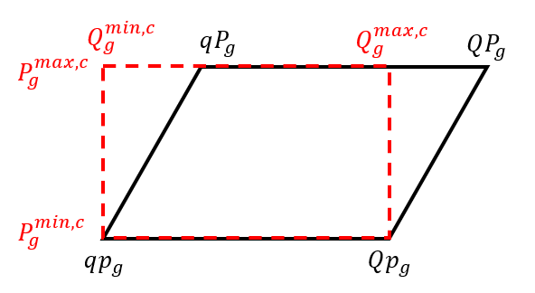

# OpenReac

OpenReac is a reactive optimal power flow that gives a set of hypotheses
for voltage and reactive controls by network equipment such as
generators, shunt compensators and transformers. OpenReac can be used
for network planning or in operation as well.

---

## Getting started

### AMPL
For this project, you must have [AMPL](https://ampl.com/) installed on your machine.
AMPL is a proprietary tool that works as an optimization modelling language, 
and it can be interfaced with many solvers.

To run OpenReac, you must add in your `~/.itools/config.yml` an ampl section like this:
```yaml
ampl:
  # Change to the ampl folder path that contains the ampl executable
  homeDir: /home/user/ampl
```

AMPL is sold by many companies, including Artelys, and you can find keys [here](https://www.artelys.com/solvers/ampl/).

### Non-linear optimization solver

To run the model implemented in AMPL, you'll need a non-linear optimization solver.
By default, the AMPL code is configured to run Knitro, which is a proprietary non-linear, but you
are free to configure a different one.

If you chose to run Knitro, you must have `knitroampl` in your path, after the installation
of the solver is done and that you got a valid licence. To check, start a bash and run:
```bash
knitroampl stub
```

Artelys is the company developing Knitro, and you can find keys
[here](https://www.artelys.com/solvers/knitro/).

---

## Reactive optimal power flow

### 1 Overview

The reactive optimal power flow (OPF) is implemented with AMPL.
Its goal is to compute voltage values on each point of the network as well as control values
for reactive equipment and controllers of the grid
(voltage set point of generating units, shunts, transformers ratios...).

In a grid development study, you decide new equipment, new generating units,
new substations, new loads, you set values for active and reactive loads,
you set values for active power generation and HVDC flows.
Then if you wish to do AC powerflow simulations with N-1 analysis, you need
all voltage and reactive set points and this reactive OPF is your solution.

Please notice that this reactive OPF does **not** decide active power of generating units and HVDC branches.


### 2 Division of the code

The code of the reactive OPF is divided into several files, 
each serving a specific function:
- `reactiveopf.dat` defines the network data files imported (files with
  *ampl_* prefix), and the files used to configure the run (files with *param_* prefix).
  Refer to section [3](#3-input).
- `reactiveopf.mod` defines the sets, parameters and optimization problems (CC, DCOPF, ACOPF) solved in `reactiveopf.run`. 
  Refer to sections [5](#5-slack-bus--main-connex-component), [6](#6-direct-current-optimal-power-flow) and [7](#7-alternative-current-optimal-power-flow).
- `reactiveopfoutput.mod` exports result files if the execution of `reactiveopf.run` is successful. 
  Refer to section [8.1](#81-in-case-of-convergence).
- `reactiveopfexit.run` contains the code executed when the process fails. 
  Refer to section [8.2](#82-in-case-of-inconsistency).
- `reactiveopf.run` executes the AMPL process of OpenReac, calling the previous scripts.

### 3 Input

#### 3.1 Network data

Files with the prefix `ampl_` contain the
data and the parameters of the network on which the reactive OPF is executed.
These files are obtained by using the
[AMPL export of PowSyBl](https://github.com/powsybl/powsybl-core/blob/main/ampl-converter/src/main/java/com/powsybl/ampl/converter/AmplNetworkWriter.java).

#### 3.2 Configuration of the run

The user can configure the run with the dedicated Java interface 
(see [OpenReacParameters](src/main/java/com/powsybl/openreac/parameters/input/OpenReacParameters.java)).
Specifically, the user can set various parameters and thresholds used in the preprocessing and modeling of the reactive OPF. 
These are specified in the file `param_algo.txt`:

| Parameter                          | Description                                                                                                                                                                       | Default value     | Domain                                        |
|------------------------------------|-----------------------------------------------------------------------------------------------------------------------------------------------------------------------------------|-------------------|-----------------------------------------------|
| `log_level_ampl`                   | Level of display for AMPL prints                                                                                                                                                  | INFO              | {DEBUG, INFO, WARNING, ERROR}                 |
| `log_level_knitro`                 | Level of display for solver prints (see [AMPL documentation](https://dev.ampl.com/ampl/options.html)                                                                              | $1$               | {0, 1, 2}                                     |  
| `objective_choice`                 | Choice of the objective function for the ACOPF (see [7](#7-alternative-current-optimal-power-flow))                                                                               | $0$               | {0, 1, 2}                                     |
| `ratio_voltage_target`             | Ratio to calculate target V of buses when `objective_choice` is set to $1$ (see [7](#7-alternative-current-optimal-power-flow))                                                   | $0.5$             | $\[0; 1\]$                                    |
| `coeff_alpha`                      | Weight to favor more/less minimization of active power produced by generators or deviation between them and target values (see [6.2](#62-alternative-current-optimal-power-flow)) | $1$               | $\[0; 1\]$                                    |
| `Pnull`                            | Threshold of active and reactive powers considered as null                                                                                                                        | $0.01$ (MW)       | $\[0; 1\]$                                    |
| `Znull`                            | Threshold of impedance considered as null (see [4.2](#))                                                                                                                          | $10^{-5}$ (p.u.)  | $\[0; 0.1\]$                                  |                                                                                                                                                                  
 | `epsilon_nominal_voltage`          | Threshold to ignore voltage levels with nominal voltage lower than it                                                                                                             | $1$ (kV)          | $\mathbb{R}^{+}$                              | 
| `min_plausible_low_voltage_limit`  | Consistency bound for low voltage limit of voltage levels (see [4.1](#41-voltage-level-limits-computation))                                                                       | $0.5$ (p.u.)      | $\mathbb{R}^{+}$                              |
| `max_plausible_high_voltage_limit` | Consistency bound for high voltage limit of voltage levels (see [4.1](#41-voltage-level-limits-computation))                                                                      | $1.5$ (p.u.)      | [`min_plausible_low_voltage_limit`; $\infty$] |
| `ignore_voltage_bounds`            | Threshold to replace voltage limits of voltage levels with nominal voltage lower than it, by  [min_plausible_low_voltage_limit; max_plausible_high_voltage_limit]                 | $0$ (p.u.)        | $\mathbb{R}^{+}$                              |
| `buses_with_reactive_slacks`       | Choice of which buses will have reactive slacks attached in ACOPF solving (see [7](#7-alternative-current-optimal-power-flow))                                                    | NO_GENERATION     | {CONFIGURED, NO_GENERATION, ALL}              |
| `PQmax`                            | Threshold for maximum active and reactive power considered in correction of generator limits  (see [4.4](#44-pq-units-domain))                                                    | $9000$ (MW, MVAr) | $\mathbb{R}$                                  |
| `defaultPmax`                      | Threshold for correction of high active power limit produced by generators (see [4.4](#44-pq-units-domain))                                                                       | $1000$ (MW)       | $\mathbb{R}$                                  |
| `defaultPmin`                      | Threshold for correction of low active power limit produced by generators (see [4.4](#44-pq-units-domain))                                                                        | $0$ (MW)          | $\mathbb{R}$                                  |
| `defaultQmaxPmaxRatio`             | Ratio used to calculate threshold for corrections of high/low reactive power limits (see [4.4](#44-pq-units-domain))                                                              | $0.3$ (MVAr/MW)   | $\mathbb{R}$                                  |
| `minimalQPrange`                   | Threshold to fix active (resp. reactive) power of generators with active (resp. reactive) power limits that are closer than it (see [4.4](#44-pq-units-domain))                   | $1$ (MW, MVAr)    | $\mathbb{R}$                                  |


In addition to the previous parameters, the user can specify which 
parameters will be variable or fixed in the ACOPF solving (see [7](#7-alternative-current-optimal-power-flow)).
This is done using the following files:

| File                                  | Description                                                                                                                                             | Default behavior of modified values                                               |
|---------------------------------------|---------------------------------------------------------------------------------------------------------------------------------------------------------|-----------------------------------------------------------------------------------|
| `param_transformers.txt`              | Ratio tap changers with a variable transformation ratio (real variable)                                                                                 | Transformation ratios are fixed                                                   |
| `param_shunt.txt`                     | Shunts with a continuous variable susceptance and which can be modified and/or connected (only if possible bus is defined in `ampl_network_shunts.txt`) | Shunt susceptances are fixed                                                      |
| `param_generators_reactive.txt`       | Generators with a constant reactive power production. If this value is not consistent (> PQmax), the reactive power production stays variable           | Coherent reactive power productions (see [4.5](#45-pq-units-domain)) are variable |
| `param_buses_with_reactive_slack.txt` | Buses with attached reactive slacks if configurable parameter buses_with_reactive_slacks = "CONFIGURED"                                                 | Only buses with no reactive power production have reactive slacks attached        |    

All of these files share the same format: 2 columns #"num" "id".

#### 3.3 New voltage limits

In addition to the elements specified in section [3.2](#32-configuration-of-the-run), the user may choose to override
the voltage limits of specified voltage levels. These values must be defined in `ampl_network_substations_override.txt` and
are employed to establish the new voltage limits as specified in section
[4.1](#41-voltage-level-limits-consistency). 

Format of `ampl_network_substations_override.txt`: 4 columns #"num" "minV (pu)" "maxV (pu)" "id"

### 4 Pre-processing

Before solving the reactive ACOPF described in [7](#7-alternative-current-optimal-power-flow), 
the following pre-processing blocks are executed to ensure the consistency of the values used in the optimization. 

#### 4.1 Voltage level limits consistency

To ensure consistent voltage level limits for the buses,
the configurable domain [`min_plausible_low_voltage_limit`; `max_plausible_high_voltage_limit`] is used
(see [3.2](#32-configuration-of-the-run)). 

Let $V_{s}^{min}$ (resp. $V_{s}^{max}$) be the low (resp. high) voltage limit of substation $s$ 
specified in `ampl_network_substations.txt` (or
in `ampl_network_substations_override.txt` if an override is given for $s$) and $V_{s}^{min,c}$ (resp. $V_{s}^{max,c}$)
its associated corrected low (resp. high) limit. Then, the limits are calculated as follows:
- $V_{s}^{min,c} = \max(V_{s}^{min},$ min_plausible_low_voltage_limit)
- $V_{s}^{max,c} = \min(V_{s}^{max},$ max_plausible_low_voltage_limit)

#### 4.2 Zero-impedance branches

Branches with an impedance magnitude, **calculated in per unit**,
lower than the configurable threshold `Znull` (see section [3.2](#32-configuration-of-the-run))
are considered as non-impedant. 
These branches will have their reactance replaced by the threshold `Znull` (in p.u.),
**even if the reactance specified in `ampl_network_branches.txt` is negative**.

#### 4.3 Impedance of transformers

In the calculations of the ACOPF (see [7](#7-alternative-current-optimal-power-flow)), 
the transformers with an impedance (specified in `ampl_network_branches.txt`)
considered as null (see [4.2](#42-zero-impedance-branches)) 
**are treated as lines**. Then, the transformation ratios/phase shifts are ignored, as well as the impedance
specified in the tap changer table `ampl_network_tct.txt`.

For phase shifters transformers considered as impedant, the reactance values from the tap changer table (in `ampl_network_tct.txt`)
replace the reactance specified in `ampl_network_branches.txt`. The resistance is then calculated proportionally. 
For the ratio tap changers, the impedance stays as specified in `ampl_network_branches.txt`. **Please notice there is no
specified handling for cases where resistance and/or reactance is negative or if there is both a ratio tap changer and a 
phase shift transformer on the same branch.**

#### 4.4 P/Q units' domain

The following corrections apply successively to determine consistent domains for the active 
power and reactive power produced by generators.

To determine the consistent domain of produced active power, the bounds of the domains
$P_g^{min}$ and $P_g^{max}$, as well as the target $P_g^{t}$ of generator $g$ (all specified in `ampl_network_generators.txt`) are used.
Let $P_{g}^{min,c}$ and $P_{g}^{max,c}$ be the corrected active bounds:

- By default, $P_{g}^{min,c} = \text{defaultPmin}$ and $P_{g}^{max,c} = \text{defaultPmax}$ (see [3.2](#32-configuration-of-the-run))
- If $|P_g^{max}| \geq \text{PQmax}$, then $P_{g}^{max,c} = \max(\text{defaultPmax}, P_g^t)$
- If $|P_g^{min}| \geq \text{PQmax}$, then $P_{g}^{min,c} = \min(\text{defaultPmin}, P_g^t)$
- If $|P_{g}^{max,c} - P_{g}^{min,c}| \leq \text{minimalQPrange}$, then $P_{g}^{max,c} = P_{g}^{min,c} = P_{g}^t$ (active power is fixed).

To determine the consistent domain of produced reactive power, the reactive power diagram 
(specified in `ampl_network_generators.txt`) of generator 
$g$ is used: $qp_g$ (resp. $qP_g$) and $Qp_g$ ($QP_g$) when $P_{g}^{min,c}$ (resp. $P_{g}^{max,c}$) is reached.
Let $qp_g^c$ (resp. $qP_g^c$) and $Qp_g^c$ (resp. $QP_g^c$) be the bounds of the corrected reactive diagram, 
and $Q_{g}^{min,c}$ and $Q_{g}^{max,c}$ be the corrected reactive bounds:

- By default, $qp_g^{c} = qP_{g}^{c} = - \text{defaultPmin} \times \text{defaultQmaxPmaxRatio}$ 
and $Qp_{g}^{c} = QP_{g}^{c} = \text{defaultPmax} \times \text{defaultQmaxPmaxRatio}$ (see [3.2](#32-configuration-of-the-run))
- If $|qp_{g}| \geq \text{PQmax}$, then $qp_{g}^{c} = -\text{defaultQmaxPmaxRatio} \times P_{max}^{g,c}$.
  Same with $qP_{g}^{c}$.
- If $|Qp_{g}| \geq \text{PQmax}$, then $Qp_{g}^{c} = \text{defaultQmaxPmaxRatio} \times P_{max}^{g,c}$.
  Same with $QP_{g}^{c}$.
- If $qp_{g}^{c} > Qp_{g}^{c}$, the values are swapped. Same with $qP_{g}^{c}$ and $QP_{g}^{c}$.
- If the corrected reactive diagram is too small (the distances between the vertices of the reactive diagram are lower than $\text{minimalQPrange}$),
  then $qp_{g}^{c} = Qp_{g}^{c} = qP_{g}^{c} = QP_{g}^{c} = \frac{qp_{g}^{c} + Qp_{g}^{c} + qP_{g}^{c} + QP_{g}^{c}}{4}$ (reactive power is fixed).
- $Q_{g}^{min,c} = \min(qp_{g}^{c}, qP_{g}^{c})$ and $Q_{g}^{max,c} = \min(Qp_{g}^{c}, QP_{g}^{c})$

Please note that in the end, **the corrected bounds are rectangular**,
not trapezoidal, and they are used only in the reactive OPF 
(see [7](#7-alternative-current-optimal-power-flow)). In addition, bounds $qP_{g}^0$ and $Qp_{g}^0$ are not used,
as generators with zero active power will be excluded from the optimisation (see [7.1](#71-generalities)).

The general correction of the generator's reactive power diagram $g$
is illustrated in the following figure:

<div style="text-align:center;">
    
</div>

### 5 Slack bus & main connex component
 
The slack bus $s$ is determined by identifying the bus with the **highest number of AC branches connected**,
within the main component (`cc` set to $0$ in `ampl_network_buses.txt`). 
If multiple buses have such cardinality, the one with the highest identifier (`num` parameter) is chosen.
In the event no bus satisfies these conditions, the first bus defined in `ampl_network_buses.txt` is selected.

The OPFs are executed on the **main connex component** (i.e. buses connected to slack bus by AC branches) of the network.
Consequently, **buses connected to the slack only by HVDC lines are excluded**.

This component is determined by solving the following optimization problem (the variables are bolded):

$$\text{minimize} \left(\sum\limits_{i} \boldsymbol{\theta_i^{cc}}\right)$$

where $\boldsymbol{\theta_i^{cc}}$ is the voltage angle of bus $i$, and with the following constraints:

$$\boldsymbol{\theta_s^{cc}} = 0 \quad (1)$$

$$\boldsymbol{\theta_i^{cc}} - \boldsymbol{\theta_j^{cc}} = 0, \quad ij \in BRANCH \quad (2)$$

$$0 \leq \boldsymbol{\theta_i^{cc}} \leq 1, \quad i \in BUS \quad (3)$$ 

If the solving is unsuccessful,  the script
`reactiveopfexit.run` is executed (see [8.2](#82-in-case-of-inconsistency)) and the execution is stopped.
The sets of buses and branches belonging to the main connex component are now denoted $BUSCC$ and $BRANCHCC$
, respectively.

### 6 Direct current optimal power flow

#### 6.1 Generalities

Before to address the ACOPF (see [7](#7-alternative-current-optimal-power-flow)), a DCOPF is solved for two main reasons:
- If the DCOPF resolution fails, it provides a strong indication that the ACOPF resolution will also fail.
  Thus, it serves as a formal consistency check on the data.
- The phases computed by DCOPF resolution will be used as initial points for the solving of the ACOPF.

#### 6.2 Optimization problem

The DCOPF model involves the following constraints, 
in addition to the slack constraint $(1)$ introduced in [5](#5-slack-bus--main-connex-component):

$$\sum\limits_{j\in v(i)} \boldsymbol{p_{ij}} = P_i^{in} + \boldsymbol{\sigma_{P,i}^{+}} - \boldsymbol{\sigma_{P,i}^{-}} - \sum\limits_{g}\boldsymbol{P_{i,g}}, \quad i\in\text{BUSCC} \quad (4)$$

where:
- $\boldsymbol{p_{ij}}$ is the active power leaving bus $i$ on branch $ij$, defined as $\boldsymbol{p_{ij}} = \frac{\boldsymbol{\theta_i} - \boldsymbol{\theta_j}}{X_{ij}}$, where 
$X_{ij}$ is the reactance of line $ij$ (specified in `ampl_network_branches.txt`).
- $P_i^{in}$ the constant active power injected or consumed in bus $i$ (by batteries, loads, VSC stations and LCC stations).
- $\boldsymbol{P_{i,g}}$ is the variable active power produced by generators of bus $i$.
- $\boldsymbol{\sigma_{P,i}^{+}}$ (resp. $\boldsymbol{\sigma_{P,i}^{-}}$) is a positive slack variable
expressing the excess (resp. shortfall) of active power produced in bus $i$.

And the following objective function:

$$\text{minimize} \left(1000 \sum\limits_{i} (\boldsymbol{\sigma_{i}^{P,+}} + \boldsymbol{\sigma_{i}^{P,-}}) + \sum\limits_{g} \left(\frac{\boldsymbol{P_{i,g}} - P_{i,g}^{t}}{\max(1, \frac{P_{i,g}^t}{100})}\right)^2\right)$$

where $P_{i,g}^{t}$ is the target of the generator $g$ on bus $i$. 

The sum of the active slack variables ($\boldsymbol{\sigma_{i}^{P,+}}$ and $\boldsymbol{\sigma_{i}^{P,-}}$) is penalized by a 
high coefficient ($1000$) to drive it towards $0$, ensuring active power balance at each bus of the network.
The solving of the DCOPF is considered as successful if this sum **does not exceed** the configurable threshold `Pnull`
(see [3.2](#32-configuration-of-the-run)), and if the non-linear solver employed (see [Non-linear solver](#non-linear-optimization-solver)) 
finds a feasible solution without reaching one of its default limit. Otherwise, the solving is considered unsuccessful and the script
`reactiveopfexit.run` is executed (see [8.2](#82-in-case-of-inconsistency)).

### 7 Alternative current optimal power flow

#### 7.1 Generalities

The goal of the reactive ACOPF is to compute voltage values on each bus, as well as control values for reactive equipment and controllers of the grid. 
Then, the following values will be variable in the optimization:
- $\boldsymbol{V_i}$ and $\boldsymbol{\theta_i}$ the voltage magnitude and phase of bus $i$.
- $\boldsymbol{P_{i,g}}$ (resp. $\boldsymbol{Q_{i,g}}$) the active (resp. reactive) power produced by variable generator $g$ of bus $i$.
- $\boldsymbol{Q_{i,vsc}}$ the reactive power produced by voltage source converter stations $vsc$ of bus $i$.
- $\boldsymbol{b_{i,g}}$ (resp. $\boldsymbol{b_{i,svc}}$) the susceptance of shunt $s$ (resp. of static var compensator $svc$) of bus $i$.
- $\boldsymbol{\rho_{ij}}$ the transformer ratio of the ratio tap changer on branch $ij$, 
specified as variable by the user (see [3.2](#32-configuration-of-the-run)).

Please note that:
- Units with active power specified in `ampl_network_generators.txt` that is less than the configurable parameter `Pnull` **are excluded from the optimization**,
  even if the user designates these generators as fixed in the parameter file `param_generators_reactive.txt` (see [3.2](#32-configuration-of-the-run)).
  Therefore, when the optimization results are exported, **these generators are exported with a reactive power target of $0$**.
- **Neither current limits nor power limits** on branches are considered in the optimization.

#### 7.2 Constraints

The constraints of the optimization problem depend on parameters specified by the user (see [3.2](#32-configuration-of-the-run)). 
In particular, the user can indicate which buses will have associated **reactive slacks** $\boldsymbol{\sigma_{i}^{Q,+}}$ and $\boldsymbol{\sigma_{i}^{Q,-}}$
, expressing the excess (resp. shortfall) of reactive power produced in bus $i$, and used to ensure reactive power balance. 
To do so, these buses must be specified in parameter file `param_buses_with_reactive_slack.txt`, and `buses_with_reactive_slacks` must be set to $\text{CONFIGURED}$.

The ACOPF involves the following constraints, in addition to the slack constraint $(1)$ introduced in [5](#5-slack-bus--main-connex-component):

$$\sum\limits_{j\in v(i)} \boldsymbol{p_{ij}} = P_i^{in} - \sum\limits_{g}\boldsymbol{P_{i,g}}, \quad i\in\text{BUSCC} \quad (5)$$

$$\sum\limits_{j\in v(i)} \boldsymbol{q_{ij}} = Q_i^{in} - \boldsymbol{\sigma_{i}^{Q,+}} + \boldsymbol{\sigma_{Q_i}^{-}} - \sum\limits_{g}\boldsymbol{Q_{i,g}} - \sum\limits_{vsc}\boldsymbol{Q_{i,vsc}} - \sum\limits_{s}\boldsymbol{b_{i,s}}{V_i}^2 - \sum\limits_{svc}\boldsymbol{b_{i,svc}}{V_i}^2, \quad i\in\text{BUSCC} \quad (6)$$

where:
- $\boldsymbol{p_{ij}}$ (resp. $\boldsymbol{q_{ij}}$) is the active (resp. reactive) power leaving bus $i$ on branch $ij$,
  calculated as defined in the [PowSyBl documentation](https://www.powsybl.org/pages/documentation/simulation/powerflow/openlf.html).
  Those are variables because they depend on $\boldsymbol{V_i}$, $\boldsymbol{V_j}$, $\boldsymbol{\theta_i}$, $\boldsymbol{\theta_j}$ and $\boldsymbol{\rho_{ij}}$.
- $P_i^{in}$ is the constant active power injected or consumed in bus $i$ by batteries, loads, VSC stations and LCC stations.
- $Q_i^{in}$ is the constant reactive power injected or consumed in bus $i$, by fixed generators and fixed shunts (see [3.2](#32-configuration-of-the-run)), batteries, loads and LCC stations.

In order to bound the variables described in [7.1](#71-generalities), the limits specified in the files of network data (see [3.1](#31-network-data)) 
are used. We specify the following special treatments:
- The voltage magnitude $\boldsymbol{V_i}$ lies between the corrected voltage limits described in [4.1](#41-voltage-level-limits-consistency).
- The reactive power $\boldsymbol{Q_{i,g}}$ produced by unit $g$ lies between the corrected limits described in [4.4](#44-pq-units-domain).
- The active power $\boldsymbol{P_{i,g}}$ also lies between the corrected limits described in [4.4](#44-pq-units-domain),
but these bounds are only considered when the configurable parameter $\alpha$ is different than $1$ (default value).
Otherwise, all active powers evolve proportionally to their initial point $P_{i,g}^t$ (specified in `ampl_network_generators.txt`):
$\boldsymbol{P_{i,g}} = P_{i,g}^t + \boldsymbol{\gamma} (P_{g}^{max,c} - P_{i,g}^t)$, where $\boldsymbol{\gamma}$ is optimized and lies in $\[-1;1\]$.
- The reactive power $\boldsymbol{Q_{i,vsc}}$ produced by voltage source converter station $vsc$ is included in $\[\min(qP_{vsc}, qp_{vsc}, qp_{vsc}^0)$; $\max(QP_{vsc}, Qp_{vsc}, Qp_{vsc}^0)\]$.
**The bounds are therefore rectangular, not trapezoidal.**

#### 7.3 Objective function

The objective function also depends on parameters specified by the user (see [3.2](#32-configuration-of-the-run)).
The `objective_choice` parameter modifies the values of penalties $\beta_1$, $\beta_2$, and $\beta_3$ in the objective function, as follows:
if `objective_choice` $= i$, then $beta_i = 1$ and $beta_j = 0.01$ pour $j \neq i$.

Specifically, if `objective_choice` takes on:
- $0$, the minimization of active power production $\sum\limits_{i,g}\boldsymbol{P_{i,g}}$ is prioritized.
- $1$, the minimization of $\sum\limits_{i} \boldsymbol{V_i}-(\rho V_i^{c,max} - (1-\rho)V_i^{c,min})^2$ is prioritized ($\rho$ 
equals the configurable parameter `ratio_voltage_target`). 
- $2$, the minimization of $\sum\limits_{i} (\boldsymbol{V_i} - V_i^t)^2$ is prioritized.

The objective function of the ACOPF is:
$$\text{minimize} \left( 10\sum\limits_{i} (\boldsymbol{\sigma_{i}^{Q,+}} + \boldsymbol{\sigma_{i}^{Q,-}}) + \beta_1 \sum\limits_{g} \left( \alpha\boldsymbol{P_{i,g}} + (1-\alpha)(\frac{\boldsymbol{P_{i,g}} - P_{i,g}^t}{\max(1, |P_{i,g}^t|)})^2 \right) + \beta_2 \sum\limits_{i} \left( \boldsymbol{V_i} - (1-\rho)V_{i}^{min,c} + \rho V_{i}^{max,c} \right)^2 + \beta_3 \sum\limits_{i} (\boldsymbol{V_i} - V_i^t)^2 + 0.1 \sum\limits_{g} \left(\frac{\boldsymbol{Q_{i,g}}}{\max(1,Q_{g}^{min,c}, Q_{g}^{max,c})}\right)^2 + 0.1 \sum\limits_{ij} (\boldsymbol{\rho_{ij}} - \rho_{ij})^2 \right)$$

where: 
- $P_{i,g}^t$ (resp. $V_i^t$) is the active target (resp. voltage initial point) specified in `ampl_network_generators.txt` (resp. `ampl_network_buses.txt`).
- $\rho_{ij}$ is the transformer ratio of line $ij$, specified in `ampl_network_tct.txt`.

The sum of the reactive slack variables is penalized by a
high coefficient ($10$) to drive it towards $0$, ensuring reactive power balance at each bus of the network.

#### 7.4 Solving

Before solving the ACOPF, the voltage magnitudes $\boldsymbol{V_i}$ are warm-started with $V_i^t$
(specified in `ampl_network_buses.txt`), as well as the voltage phases $\boldsymbol{\theta_i}$ with the results of the DCOPF (see [6](#6-direct-current-optimal-power-flow)).

The solving is considered as successful if the non-linear solver employed (see [Non-linear solver](#non-linear-optimization-solver)) 
finds a feasible approximate solution (**even if the sum of 
slacks is important**), and the script `reactiveopfoutput.run` is executed (see [8.1](#81-in-case-of-convergence)). 

Note that if the solving of ACOPF fails, and the $\alpha$ parameter is set to $1$ (default value),
then a new resolution is attempted, with $\alpha$ set to zero. This gives more freedom to the active powers
produced (see [7.2](#72-constraints)), leaving these variables free withing their respective bounds.

If ACOPF solving fails another time, the script `reactiveopfexit.run` is executed (see [8.2](#82-in-case-of-inconsistency)).

### 8 Output

#### 8.1 In case of convergence

After the solving of the ACOPF, the script `reactiveopfoutput.run` is executed 
 and the following files (except `reactiveopf_results_indic.txt`) are exported only if the solving 
is considered as successful (see [7](#7-alternative-current-optimal-power-flow)):

| File                                              | Content                                                                                                                                                                                                                                                                                                                                                      | Format                                                                                          |
|---------------------------------------------------|--------------------------------------------------------------------------------------------------------------------------------------------------------------------------------------------------------------------------------------------------------------------------------------------------------------------------------------------------------------|-------------------------------------------------------------------------------------------------|
| `reactiveopf_results_indic.txt`                   | General information (system OS, computation time, etc.). The configurable thresholds/parameters (see section [3.2](#32-configuration-of-the-run)). The cardinality of the sets (number of non-impedance branches, number of slack variables, etc.). Information about calculated angles (maximum/minimum theta, maximum difference between neighbors, etc.). |                                                                                                 |
| `reactiveopf_results_static_var_compensators.csv` | Calculated voltage and reactive power values for the SVC that regulate voltage.                                                                                                                                                                                                                                                                              | 6 columns #"variant" "num" "bus" "vRegul" "V(pu)" "Q(MVAr)"                                     |
| `reactiveopf_results_shunts.csv`                  | Calculated reactive power (and susceptance) values for shunts that were either connected or modified after the optimization problems were resolved.                                                                                                                                                                                                          | 6 columns #"variant" "num" "bus" "b(pu)" "Q(MVAr)" "section"                                    |
| `reactiveopf_results_generators.csv`              | Calculated active and reactive power values for generating units.                                                                                                                                                                                                                                                                                            | 9 columns #"variant" "num" "bus" "vRegul" "V(pu)" "targetP(MW)" "targetQ(MVAr)" "P(MW)" "Q(MW)" |
| `reactiveopf_results_vsc_converter_stations.csv`  | Calculated reactive power values for VSC converter stations.                                                                                                                                                                                                                                                                                                 | 8 columns #"variant" "num" "bus" "vRegul" "targetV(pu)" "targetQ(MVAr)" "P(MW)" "Q(MVAr)"       |
| `reactiveopf_results_rtc.csv`                     | RTCs and associated taps, with transformer ratio closest to the one calculated after the optimization.                                                                                                                                                                                                                                                       | 3 columns #"variant" "num" "tap"                                                                |
| `reactiveopf_results_reactive_slacks.csv`         | Calculated reactive slack variables $\boldsymbol{\sigma^{Q,-}}$ and $\boldsymbol{\sigma^{Q,+}}$.                                                                                                                                                                                                                                                             | 6 columns #"variant" "bus" "slack_condensator(MVAr)" "slack_self(MVAr)" "id" "substation"       |
| `reactiveopf_results_voltages.csv`                | Calculated voltages for each bus of the main connex component (see [5](#5-slack-bus--main-connex-component)).                                                                                                                                                                                                                                                | 5 columns #"variant" "bus" "V(pu)" "theta(rad)" "id"                                            |

If ACOPF solving is not successful, the user can export the following optional files (aiding for the analysis of ACOPF results) by specifying the
 ampl log parameter to a debug level (see [3.2](#32-configuration-of-the-run)):

| File                                       | Content                                                                                                                | Format                                                                                                                  |
|--------------------------------------------|------------------------------------------------------------------------------------------------------------------------|-------------------------------------------------------------------------------------------------------------------------|
| `debug_bus.csv`                            | Information on calculated voltages (values, bounds, repartition, etc.).                                                | 13 columns #"bus_id" "Vnom" "V" "Vlb" "Vub" "Vmin_mod" "Vmax_mod" "Vmin_OK" "Vmax_OK" "Vmin_ori" "Vmax_ori" "sQ1" "sQ2" |
| `reactiveopf_results_generators_Pnull.csv` | Information on units that are excluded from the solving of ACOPF (see [7](#7-alternative-current-optimal-power-flow)). | 11 columns #"variant" "num" "bus" "vRegul" "V(pu)" "targetP(MW)" "targetQ(Mvar)" "P(MW)" "Q(MW)" "id" "bus_id"          |

#### 8.2 In case of inconsistency

If the computation of the main connex component (see [5](#5-slack-bus--main-connex-component)) or 
of the DCOPF fails (see [6](#6-direct-current-optimal-power-flow)),
the problem is considered as inconsistent.
Then, the script `reactiveopfexit.run` is executed and the file `reactiveopf_results_indic.txt` described in [8.1](#81-in-case-of-convergence)
 is exported, without the information on the calculated angles.
